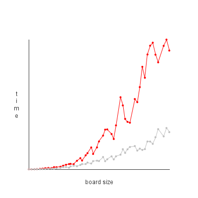

# Flood It!

## Flood.java

> ### Functions Implemented

> #### flood

- Parameter List : `WaterColor color, LinkedList<Coord> flooded_list,
  Tile[][] tiles, Integer board_size`
    
- Return : `void`
    
- Data Structures Used : `flooded_list -> LinkedList<Coord>`
    
- Method Calls : `recurve_flooding_TR`

> #### recurve_flooding_TR

- Parameter List : `WaterColor color, LinkedList<Coord> flooded_list,
  Tile[][] tiles, Integer board_size`
    
- Return : `LinkedList<Coord>`
    
- Method Calls : `recurve_flooding_helper`

> #### recurve_flooding_helper

- Parameter List : `WaterColor color, LinkedList<Coord> flooded_list,
  Tile[][] tiles, Integer board_size,
  LinkedList<Coord> acc, int calls`
    
- Return : `LinkedList<Coord>`
    
- Data Structures Used : `LinkedList, HashSet`
    
- Description : Function is a tail-recursive helper that uses the original
  `flooded_list` passed down from `flood` and `recurve_flood_TR`
  to create and accumulate a unique `LinkedList<Coord>` comprising
  a union of the original flooded list and all immediate user specified neighbouring
  `color` regions in board
    
- ##### Algorithm :

1. The function iterates through every coordinate in the
   original `flooded_list` and determines all the immediate neighbours
   having the user specified `color`
2. These neighbours are accumulated into a new `LinkedList<Coord> new_tiles`
3. The final accumulator`LinkedList<Coord> acc` is populated with the `new_tiles`
4. The function is called recursively as such:  
   `recurve_flooding_helper(color, new_tiles, tiles, board_size, acc, ++calls);`
5. Now, the `new_tiles` are the input for recursion to accumulate all the
   `color` regions and not just singular point neighbours
6. The function is called recursively until there are no more neighbours
   to evaluate
7. When the check `if (flooded_list.isEmpty())` passes, a new `HashSet<Coord>`
   is created using the final accumulator `acc`
8. `acc` is cleared and repopulated with the `HashSet<Coord>` to remove
   any duplicates
9. Ignoring this step not only consumes time and space exponentially,
   but the check `board.fullyFlooded()` never passes and the game is never won

--- 

---

## Questions

1. What function roughly fits that graph?
   : f(n) = n2

2. What is the time complexity of your `flood()` function based on analyzing its code?
   : O(n2) : This is due to the fact that the tail recursion method
   contains two `for` loops

3. Does your analysis match up with what you see in the graph?
   : Yes

4. What data structures did you use (linked lists, arrays…) ? Is the time complexity of your flood function the best it
   can be or can you do better? Why?
   : Data Structures Used : `LinkedList` and `HashSet`
     
   Yes, this function can be optimized

> #### Optimized Flood : `recurve_flooding_TR_optimized()` and helper

- Parameter List : `WaterColor color, LinkedList<Coord> flooded_list,
  Tile[][] tiles, Integer board_size`
    
- Return : `LinkedList<Coord>`
    
- Data Structures Used : `LinkedList, HashSet`
    
- Description : Function is a tail-recursive helper that uses the original
  `flooded_list` passed down from `flood1` and `recurve_flood_TR_optimized`
  to create and accumulate a unique `LinkedList<Coord>` comprising
  a union of the original flooded list and all immediate user specified neighbouring
  `color` regions in board
    
- ##### Algorithm :

1. The function iterates through every coordinate in the
   original `flooded_list` and accumulates all the neighbours into a `HashSet`to avoid duplicates

2. Then, we iterate through all these neighbours and determine
   all the immediate `color` specified regions
3. We add all these newly found regions into a new `HashSet<Coord> new_tiles`

4. The final accumulator`LinkedList<Coord> acc` is populated with the `new_tiles`
5. The function is called recursively as such:  
   `recurve_flooding_helper_optimized(color, new LinkedList<>(new_tiles), tiles, board_size, acc)`
6. Now, the `new_tiles` are the input for recursion to accumulate all the
   `color` regions and not just singular point neighbours
7. This ensures that we are not reevaluating points which were in the previous `flooded_list`
   which now have neighbours of the same colour, thus rendering them obsolete
8. The function is called recursively until there are no more neighbours
   to evaluate
9. When the check `if (flooded_list.isEmpty())` passes, we return the accumulator `acc`

The optimized algorithm now has a time complexity of `O(m*n)` because the `for` loops are separated
Moreover, we can also evaluate the time complexity by fitting it to an n-degree polynomial
and comparing the coefficient correlation impact.

> Algorithm Comparison

|                                                                                 | `recurve_flood_TR`                                                                         | `recurve_flood_TR_optimized`                               |
|---------------------------------------------------------------------------------|--------------------------------------------------------------------------------------------|------------------------------------------------------------| 
| Total Tiles Evaluated (50 games played up to 10,000 tiles (200 tile step size)) | 1,110,615,276   (3.5x more tiles iterated)                                              | 324,724,865 (70% less tiles evaluated)                     |
| Time Difference                                                                 | Range : [7.2265E-5, 33.8524263] (2-3x slower)                                              | Range : [3.3993E-5, 10.5896895] (~200-300% faster)         |
| Code Difference                                                                 | Nested For loops (2) dominates time complexity O(n2)                         | Separate For loops reduces time complexity to 2*O(n) loops |
|                                                                                 | Accumulator is converted to `HashSet` and reconverted to `LinkedList` to remove duplicates | Accumulator is always devoid of duplicates                 |
|                                                                                 |                                                                                            |                                                            |

